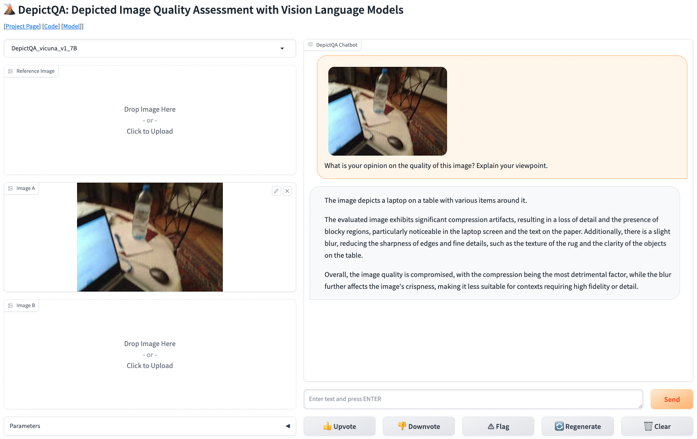

# DepictQA: Depicted Image Quality Assessment with Vision Language Models


<p align="center">
    
</p>


<p align="center">
    <font size='4'>
        <a href="https://depictqa.github.io/" target="_blank">🌏 Project Page</a> • 📀 Datasets ( <a href="https://huggingface.co/datasets/zhiyuanyou/DataDepictQA" target="_blank">huggingface</a> / <a href="https://modelscope.cn/datasets/zhiyuanyou/DataDepictQA" target="_blank">modelscope</a> )
    </font>
</p>

Official pytorch implementation of the papers: 

- DepictQA-Wild (DepictQA-v2): [paper](https://arxiv.org/abs/2405.18842), [project page](https://depictqa.github.io/depictqa-wild/). 

    Zhiyuan You, Jinjin Gu, Zheyuan Li, Xin Cai, Kaiwen Zhu, Chao Dong, Tianfan Xue, "Descriptive Image Quality Assessment in the Wild," arXiv preprint arXiv:2405.18842, 2024.

- DepictQA-v1: [paper](https://arxiv.org/abs/2312.08962), [project page](https://depictqa.github.io/depictqa-v1/). 

    Zhiyuan You, Zheyuan Li, Jinjin Gu, Zhenfei Yin, Tianfan Xue, Chao Dong, "Depicting beyond scores: Advancing image quality assessment through multi-modal language models," ECCV, 2024.

<p align="center">
    
</p>


## Update

📆 [2025.02] [DeQA-Score](https://depictqa.github.io/deqa-score/) was accepted to CVPR 2025.

📆 [2025.01] We released [DeQA-Score](https://depictqa.github.io/deqa-score/), a distribution-based depicted image quality assessment model for score regression. [Datasets](https://huggingface.co/datasets/zhiyuanyou/Data-DeQA-Score), [codes](https://github.com/zhiyuanyou/DeQA-Score), and model weights ([full tuning](https://huggingface.co/zhiyuanyou/DeQA-Score-Mix3) / [LoRA tuning](https://huggingface.co/zhiyuanyou/DeQA-Score-LoRA-Mix3)) were available.

📆 [2024.07] DepictQA datasets were released in <a href="https://huggingface.co/datasets/zhiyuanyou/DataDepictQA" target="_blank">huggingface</a> / <a href="https://modelscope.cn/datasets/zhiyuanyou/DataDepictQA" target="_blank">modelscope</a>.

📆 [2024.07] [DepictQA-v1](https://depictqa.github.io/depictqa-v1/) was accepted to ECCV 2024.

📆 [2024.05] We released [DepictQA-Wild](https://depictqa.github.io/depictqa-wild/) (DepictQA-v2): a multi-functional in-the-wild descriptive image quality assessment model.

📆 [2023.12] We released [DepictQA-v1](https://depictqa.github.io/depictqa-v1/), a multi-modal image quality assessment model based on vision language models.

## Installation

- Create environment. 

    ```
    # clone this repo
    git clone https://github.com/XPixelGroup/DepictQA.git
    cd DepictQA

    # create environment
    conda create -n depictqa python=3.10
    conda activate depictqa
    pip install -r requirements.txt
    ```

- Download pretrained models. 
    - [CLIP-ViT-L-14](https://openaipublic.azureedge.net/clip/models/b8cca3fd41ae0c99ba7e8951adf17d267cdb84cd88be6f7c2e0eca1737a03836/ViT-L-14.pt). Required. 
    - [Vicuna-v1.5-7B](https://huggingface.co/lmsys/vicuna-7b-v1.5). Required. 
    - [All-MiniLM-L6-v2](https://huggingface.co/sentence-transformers/all-MiniLM-L6-v2). Required only for confidence estimation of detailed reasoning responses. 
    - Our pretrained delta checkpoint (see [Models](#models)). Optional for training. Required for demo and inference. 


- Ensure that all downloaded models are placed in the designated directories as follows. 
    ```
    |-- DepictQA
    |-- ModelZoo
        |-- CLIP
            |-- clip
                |-- ViT-L-14.pt
        |-- LLM
            |-- vicuna
                |-- vicuna-7b-v1.5
        |-- SentenceTransformers
            |-- all-MiniLM-L6-v2
    ```

    If models are stored in different directories, revise _config.model.vision\_encoder\_path_, _config.model.llm\_path_, and _config.model.sentence\_model_ in _config.yaml_ (under the experiments directory) to set new paths. 


- Move our pretrained delta checkpoint to a specific experiment directory (_e.g._, DQ495K, DQ495K_QPath) as follows. 

    ```
    |-- DepictQA
        |-- experiments
            |-- a_specific_experiment_directory
                |-- ckpt
                    |-- ckpt.pt
    ```

    If the delta checkpoint is stored in another directory, revise _config.model.delta\_path_ in _config.yaml_ (under the experiments directory) to set new path. 


## Models

| Training Data | Tune | Hugging Face | Description | 
| -------- | -------- | -------- | -------- |
| DQ-495K + KonIQ + SPAQ | Abstractor, LORA | [download](https://huggingface.co/zhiyuanyou/DepictQA2-Abstractor-DQ495K) | Vision abstractor to reduce token numbers. Trained on DQ-495K, KonIQ, and SPAQ datasets. Able to handle images with resolution larger than 1000+, and able to compare images with different contents. |
| DQ-495K + Q-Instruct | Projector, LORA, | [download](https://huggingface.co/zhiyuanyou/DepictQA2-DQ495K-QInst) | Trained on DQ-495K and Q-Instruct (see [paper](https://arxiv.org/abs/2311.06783)) datasets. Able to complete multiple-choice, yes-or-no, what, how questions, but degrades in assessing and comparison tasks. |
| DQ-495K + Q-Pathway | Projector, LORA | [download](https://huggingface.co/zhiyuanyou/DepictQA2-DQ495K-QPath) | Trained on DQ-495K and Q-Pathway (see [paper](https://arxiv.org/abs/2311.06783)) datasets. Performs well on real images, but degrades in comparison tasks. |
| DQ-495K | Projector, LORA | [download](https://huggingface.co/zhiyuanyou/DepictQA2-DQ495K) | Trained on DQ-495K dataset. Used in our paper. |


## Demos

<p align="center">
    
</p>

### Online Demo

We provide an online demo (coming soon) deployed on huggingface spaces.

### Gradio Demo

We provide a gradio demo for local test. 

- cd a specific experiment directory: `cd experiments/a_specific_experiment_directory`

- Check [Installation](#installation) to make sure (1) the environment is installed, (2) CLIP-ViT-L-14, Vicuna-v1.5-7B, and the pretrained delta checkpoint are downloaded and (3) their paths are set in _config.yaml_. 

- Launch controller: `sh launch_controller.sh`

- Launch gradio server: `sh launch_gradio.sh`

- Launch DepictQA worker: `sh launch_worker.sh id_of_one_gpu`

You can revise the server config in _serve.yaml_. The url of deployed demo will be _http://{serve.gradio.host}:{serve.gradio.port}_. The default url is http://0.0.0.0:12345 if you do not revise _serve.yaml_. 

Note that **multiple workers can be launched simultaneously**. For each worker, _serve.worker.host_, _serve.worker.port_, _serve.worker.worker\_url_, and _serve.worker.model\_name_ should be unique. 

## Datasets

- Source codes for DQ-495K (used in DepictQA-v2) dataset construction are provided in [here](./build_datasets/). 

- Download MBAPPS (used in DepictQA-v1) and DQ-495K (used in DepictQA-v2) datasets from <a href="https://huggingface.co/datasets/zhiyuanyou/DataDepictQA" target="_blank">huggingface</a> / <a href="https://modelscope.cn/datasets/zhiyuanyou/DataDepictQA" target="_blank">modelscope</a>. Move the dataset to the same directory of this repository as follows. 

    ```
    |-- DataDepictQA
    |-- DepictQA
    ```

    If the dataset is stored in another directory, revise _config.data.root\_dir_ in _config.yaml_ (under the experiments directory) to set new path. 

## Training

- cd a specific experiment directory: `cd experiments/a_specific_experiment_directory`

- Check [Installation](#installation) to make sure (1) the environment is installed, (2) CLIP-ViT-L-14 and Vicuna-v1.5-7B are downloaded and (3) their paths are set in _config.yaml_. 

- Run training: `sh train.sh ids_of_gpus`. 


## Inference

### Inference on Our Benchmark

- cd a specific experiment directory: `cd experiments/a_specific_experiment_directory`

- Check [Installation](#installation) to make sure (1) the environment is installed, (2) CLIP-ViT-L-14, Vicuna-v1.5-7B, and the pretrained delta checkpoint are downloaded and (3) their paths are set in _config.yaml_. 

- Run a specific inference script (_e.g._, _infer_A_brief.sh_): `sh infer_A_brief.sh id_of_one_gpu`.

### Inference on Custom Dataset

- Construct _*.json_ file for your dataset as follows.

    ```
    [
        {
            "id": unique id of each sample, required, 
            "image_ref": reference image, null if not applicable, 
            "image_A": image A, null if not applicable, 
            "image_B": image B, null if not applicable, 
            "query": input question, required, 
        }, 
        ...
    ]
    ```

- cd your experiment directory: `cd your_experiment_directory`

- Check [Installation](#installation) to make sure (1) the environment is installed, (2) CLIP-ViT-L-14, Vicuna-v1.5-7B, and the pretrained delta checkpoint are downloaded and (3) their paths are set in _config.yaml_. 

- Construct your inference script as follows.

    ```
    #!/bin/bash
    src_dir=directory_of_src
    export PYTHONPATH=$src_dir:$PYTHONPATH
    export CUDA_VISIBLE_DEVICES=$1

    python $src_dir/infer.py \
        --meta_path json_path_1_of_your_dataset \
                    json_path_2_of_your_dataset \
        --dataset_name your_dataset_name_1 \
                       your_dataset_name_2 \
        --task_name task_name \
        --batch_size batch_size \
    ```

    `--task_name` can be set as follows. 

    | Task Name | Description |
    | -------- | -------- |
    | _quality\_compare_ | AB comparison in full-reference |
    | _quality\_compare\_noref_ | AB comparison in non-reference |
    | _quality\_single\_A_ | Image A assessment in full-reference |
    | _quality\_single\_A\_noref_ | Image A assessment in non-reference |
    | _quality\_single\_B_ | Image B assessment in full-reference |
    | _quality\_single\_B\_noref_ | Image B assessment in non-reference |

- Run your inference script: `sh your_infer_script.sh id_of_one_gpu`.


## Evaluation

- cd the evaluation directory: `cd src/eval`. 

- Various evaluation scripts are explained as follows. 

    | Script | Description |
    | -------- | -------- |
    | `cal_acc_single_distortion.py` | accuracy of single-distortion identification |
    | `cal_acc_multi_distortion.py` | accuracy of multi-distortion identification |
    | `cal_acc_rating.py` | accuracy of instant rating |
    | `cal_gpt4_score_detail_v1.py` | GPT-4 score of detailed reasoning tasks in DepictQA-v1. Treat both prediction and ground truth as assistants, calculate the relative score of prediction over ground truth. |
    | `cal_gpt4_score_detail_v2.py` | GPT-4 score of detailed reasoning tasks in DepictQA-v2. Only treat prediction as an assistant, directly assess the consistency between prediction and ground truth. |

- Run basic evaluation (_e.g._, _cal\_acc\_single\_distortion.py_): 

    ```
    python cal_acc_single_distortion.py --pred_path predict_json_path --gt_path ground_truth_json_path
    ```

    Some specific parameters are explained as follows. 

    For the calculation of accuracy: 
    - `--confidence` (store_true): whether to calculate accuracy within various confidence intervals. 
    - `--intervals` (list of float, default [0, 0.5, 0.6, 0.7, 0.8, 0.9, 0.95, 1]): the confidence intervals, only valid when `--confidence` is true. 

    For the calculation of GPT-4 score:
    - `--save_path` (str, required): _*.json_ path to save the evaluation results including scores and reasons. 

## Inference and Evaluation of SRCC / PLCC Results (Voting Method)

We provide scripts to infer and evaluate the SRCC / PLCC results on the KADID10K, CSIQ, and TID2013 datasets.

- cd the experiment directory: `cd experiments/MBAPPS`.
- run the inference script: `sh infer_srcc_plcc_voting.sh id_of_one_gpu`.
- run the evaluation script: `sh eval_srcc_plcc_voting.sh`.

## Acknowledgement

This repository is based on [LAMM](https://github.com/OpenGVLab/LAMM/tree/main). Thanks for this awesome work.


## BibTeX

If you find our work useful for your research and applications, please cite using the BibTeX:

```
@inproceedings{deqa_score,
  title={Teaching Large Language Models to Regress Accurate Image Quality Scores using Score Distribution},
  author={You, Zhiyuan and Cai, Xin and Gu, Jinjin and Xue, Tianfan and Dong, Chao},
  booktitle={IEEE Conference on Computer Vision and Pattern Recognition},
  year={2025},
}

@article{depictqa_v2,
    title={Descriptive Image Quality Assessment in the Wild},
    author={You, Zhiyuan and Gu, Jinjin and Li, Zheyuan and Cai, Xin and Zhu, Kaiwen and Dong, Chao and Xue, Tianfan},
    journal={arXiv preprint arXiv:2405.18842},
    year={2024}
}

@inproceedings{depictqa_v1,
    title={Depicting Beyond Scores: Advancing Image Quality Assessment through Multi-modal Language Models},
    author={You, Zhiyuan and Li, Zheyuan and Gu, Jinjin and Yin, Zhenfei and Xue, Tianfan and Dong, Chao},
    booktitle={European Conference on Computer Vision},
    year={2024}
}
```

## Practical Notes - Issues
### Issue - The empty models array

Because no workers have been registered with the controller. Here's what's happening:
The system has a 3-part architecture:

Gradio web server (UI)

Controller (manages workers)

Workers (run the actual models)

When you run launch_gradio.sh and launch_controller.sh, you've started the web UI and controller, but no workers are running. The workers are what actually host the models and do the inference.
Looking at the configuration in serve.yaml, you need to:

Start the controller (port 10000)

Start at least one worker (port 22222)

Start the gradio web UI (port 8081)

### Issue - the MPS framework doesn't support float64
```
2025-09-02 14:05:29 | INFO | stdout | INFO:     127.0.0.1:62634 - "POST /worker_generate_stream HTTP/1.1" 200 OK
2025-09-02 14:05:29 | INFO | model_worker | Task: quality_single_A
2025-09-02 14:05:29 | INFO | model_worker | Reference path: ../log_serve/serve_images/2025-09-02/e003dec3dcd0ae2a62707dfafc03c34b.png
2025-09-02 14:05:29 | INFO | model_worker | Image A path: ../log_serve/serve_images/2025-09-02/36b5474e095f522961deacaec7fac849.png
2025-09-02 14:05:29 | INFO | model_worker | Image B path: None
2025-09-02 14:05:29 | INFO | model_worker | query: 
2025-09-02 14:05:29 | ERROR | stderr | --- Logging error ---
2025-09-02 14:05:29 | ERROR | stderr | Traceback (most recent call last):
2025-09-02 14:05:29 | ERROR | stderr |   File "/Users/gavinxiang/Downloads/DepictQA-Exercise/src/model/depictqa.py", line 113, in load_img
2025-09-02 14:05:29 | ERROR | stderr |     img = self.vision_preprocess(img).to(device)  # [1, 3, H, W]
2025-09-02 14:05:29 | ERROR | stderr |   File "/Users/gavinxiang/Downloads/DepictQA-Exercise/src/model/clip/clip.py", line 150, in __call__
2025-09-02 14:05:29 | ERROR | stderr |     img = torch.tensor(img).permute(2, 0, 1).to(device)
2025-09-02 14:05:29 | ERROR | stderr | TypeError: Cannot convert a MPS Tensor to float64 dtype as the MPS framework doesn't support float64. Please use float32 instead.

```

```
# src/model/clip/clip.py
- img = np.array(img) / 255.0
+ img = np.array(img, dtype=np.float32) / 255.0

  device = torch.device("mps" if torch.backends.mps.is_available() else "cpu")
  
- img = torch.tensor(img).permute(2, 0, 1).to(device)
+ img = torch.tensor(img, dtype=torch.float32).permute(2, 0, 1).to(device)
```

### Issue  - 'LoraModel' object has no attribute 'generate'
```
2025-09-02 14:14:06 | INFO | model_worker | Task: quality_compare
2025-09-02 14:14:06 | INFO | model_worker | Reference path: ../log_serve/serve_images/2025-09-02/abbb9c573fcf890b230e23112a44a854.png
2025-09-02 14:14:06 | INFO | model_worker | Image A path: ../log_serve/serve_images/2025-09-02/57a14c89cb3fec45a8f9e3ca4b96f731.png
2025-09-02 14:14:06 | INFO | model_worker | Image B path: ../log_serve/serve_images/2025-09-02/ac19476180c596a1288e6e94beb0895d.png
2025-09-02 14:14:06 | INFO | model_worker | query: 
2025-09-02 14:14:17 | ERROR | stderr | Exception in thread Thread-3 (generate):
2025-09-02 14:14:17 | ERROR | stderr | Traceback (most recent call last):
2025-09-02 14:14:17 | ERROR | stderr |   File "/Users/gavinxiang/miniconda3/envs/depictqa/lib/python3.10/site-packages/peft/tuners/lora.py", line 278, in __getattr__
2025-09-02 14:14:17 | ERROR | stderr |     return super().__getattr__(name)  # defer to nn.Module's logic
2025-09-02 14:14:17 | ERROR | stderr |   File "/Users/gavinxiang/miniconda3/envs/depictqa/lib/python3.10/site-packages/torch/nn/modules/module.py", line 1962, in __getattr__
2025-09-02 14:14:17 | ERROR | stderr |     raise AttributeError(
2025-09-02 14:14:17 | ERROR | stderr | AttributeError: 'LoraModel' object has no attribute 'generate'
```

```
# src/model/depictqa.py
- outputs = self.llm.generate(**inputs_generate)

# Use the base model's generate method since LoRA doesn't support it directly
+ outputs = self.llm.base_model.generate(**inputs_generate)
```

### Issue - AttributeError: 'AsyncRequest' object has no attribute '_json_response_data'
```
2025-09-02 14:23:09 | INFO | gradio_web_server | load_demo. ip: 127.0.0.1
2025-09-02 14:23:09 | INFO | gradio_web_server | Models: ['DepictQA_vicuna_v1_7B']
2025-09-02 14:23:20 | INFO | gradio_web_server | add_text. ip: 127.0.0.1. len: 0
2025-09-02 14:23:20 | INFO | gradio_web_server | ('', [<PIL.Image.Image image mode=RGB size=3169x4753 at 0x17F75C7C0>, <PIL.Image.Image image mode=RGB size=3840x2160 at 0x17F75CA00>, <PIL.Image.Image image mode=RGB size=4000x6001 at 0x17F75CA30>])
2025-09-02 14:23:20 | ERROR | asyncio | Task exception was never retrieved
future: <Task finished name='pf5ru7m0sej_9' coro=<Queue.process_events() done, defined at /Users/gavinxiang/miniconda3/envs/depictqa/lib/python3.10/site-packages/gradio/queueing.py:342> exception=AttributeError("'AsyncRequest' object has no attribute '_json_response_data'")>
Traceback (most recent call last):
  File "/Users/gavinxiang/miniconda3/envs/depictqa/lib/python3.10/site-packages/gradio/queueing.py", line 369, in process_events
    while response.json.get("is_generating", False):
  File "/Users/gavinxiang/miniconda3/envs/depictqa/lib/python3.10/site-packages/gradio/utils.py", line 543, in json
    return self._json_response_data
AttributeError: 'AsyncRequest' object has no attribute '_json_response_data'
2025-09-02 14:23:20 | INFO | gradio_web_server | http_bot. ip: 127.0.0.1
2025-09-02 14:23:20 | INFO | gradio_web_server | model_name: DepictQA_vicuna_v1_7B, worker_addr: http://127.0.0.1:22222
2025-09-02 14:23:20 | INFO | gradio_web_server | ==== request ====
{'img_paths': ['../log_serve/serve_images/2025-09-02/549ae371eaaf2c4ab382628d16b761a0.png', '../log_serve/serve_images/2025-09-02/342cf853a215ea7d84da0f353e1750d5.png', '../log_serve/serve_images/2025-09-02/57a14c89cb3fec45a8f9e3ca4b96f731.png'], 'query': '', 'task_type': 'quality_compare', 'temperature': 0.0, 'top_p': 0.9, 'max_new_tokens': 400, 'max_all_tokens': 512, 'stop': '</s>'}
2025-09-02 14:23:20 | INFO | httpx | HTTP Request: POST http://127.0.0.1:8081/api/predict "HTTP/1.1 200 OK"
2025-09-02 14:23:25 | INFO | httpx | HTTP Request: POST http://127.0.0.1:8081/reset "HTTP/1.1 200 OK"
```

```
# src/serve/gradio_web_server.py
try:
except json.JSONDecodeError:
                    logger.error(f"Failed to decode JSON from chunk: {chunk}")
                    continue
```

### Issue - UserWarning: Failed to load image Python extension

```
(depictqa) ➜  DQ495K_Abstractor git:(main) ✗ sh launch_worker.sh
Setting ds_accelerator to cuda (auto detect)
/Users/gavinxiang/miniconda3/envs/depictqa/lib/python3.10/site-packages/deepspeed/runtime/zero/linear.py:49: FutureWarning: `torch.cuda.amp.custom_fwd(args...)` is deprecated. Please use `torch.amp.custom_fwd(args..., device_type='cuda')` instead.
  def forward(ctx, input, weight, bias=None):
/Users/gavinxiang/miniconda3/envs/depictqa/lib/python3.10/site-packages/deepspeed/runtime/zero/linear.py:67: FutureWarning: `torch.cuda.amp.custom_bwd(args...)` is deprecated. Please use `torch.amp.custom_bwd(args..., device_type='cuda')` instead.
  def backward(ctx, grad_output):
/Users/gavinxiang/miniconda3/envs/depictqa/lib/python3.10/site-packages/torchvision/io/image.py:13: UserWarning: Failed to load image Python extension: dlopen(/Users/gavinxiang/miniconda3/envs/depictqa/lib/python3.10/site-packages/torchvision/image.so, 0x0006): Symbol not found: __ZN3c1017RegisterOperatorsD1Ev
  Referenced from: <0B637046-A38B-3A5C-80C6-E847C27DCCD5> /Users/gavinxiang/miniconda3/envs/depictqa/lib/python3.10/site-packages/torchvision/image.so
  Expected in:     <B6BD92AE-4D03-3F92-9E03-2E2594A12866> /Users/gavinxiang/miniconda3/envs/depictqa/lib/python3.10/site-packages/torch/lib/libtorch_cpu.dylib
  warn(f"Failed to load image Python extension: {e}")
```

```
# expriments/DQ495K_Abstractor/launch_worker.sh
#!/bin/bash
export PYTHONPATH=../../src/:$PYTHONPATH
export PYTORCH_ENABLE_MPS_FALLBACK=1

python -m serve.depictqa_worker --cfg config_mps.yaml

```

```
# src/model/depictqa.py
        # Load model with device placement and dtype handling
        self.device = torch.device("mps" if torch.backends.mps.is_available() else "cpu")
        self.llm = AutoModelForCausalLM.from_pretrained(
            llm_path,
            trust_remote_code=True,
            torch_dtype=torch.float32,  # Use float32 for MPS
            device_map={"": self.device}  # Place all modules on MPS
        )
```

Added disk offloading with offload_folder="offload"
`mkdir -p offload`

`pip install -U bitsandbytes`


### Issue - RuntimeError: Input type (MPSFloatType) and weight type (torch.FloatTensor) should be the same
```
2025-09-02 14:48:47 | INFO | model_worker | query: 
2025-09-02 14:48:47 | ERROR | stderr | Exception in thread Thread-3 (generate):
2025-09-02 14:48:47 | ERROR | stderr | Traceback (most recent call last):
2025-09-02 14:48:47 | ERROR | stderr |   File "/Users/gavinxiang/miniconda3/envs/depictqa/lib/python3.10/threading.py", line 1016, in _bootstrap_inner
2025-09-02 14:48:47 | ERROR | stderr |     self.run()
2025-09-02 14:48:47 | ERROR | stderr |   File "/Users/gavinxiang/miniconda3/envs/depictqa/lib/python3.10/threading.py", line 953, in run
2025-09-02 14:48:47 | ERROR | stderr |     self._target(*self._args, **self._kwargs)
2025-09-02 14:48:47 | ERROR | stderr |   File "/Users/gavinxiang/Downloads/DepictQA-Exercise/src/model/depictqa.py", line 451, in generate
2025-09-02 14:48:47 | ERROR | stderr |     input_embs, attn_mask = self.get_generate_embs(inputs)
2025-09-02 14:48:47 | ERROR | stderr |   File "/Users/gavinxiang/Downloads/DepictQA-Exercise/src/model/depictqa.py", line 422, in get_generate_embs
2025-09-02 14:48:47 | ERROR | stderr |     img_embs = self.emb_img(inputs["img_path"])
2025-09-02 14:48:47 | ERROR | stderr |   File "/Users/gavinxiang/Downloads/DepictQA-Exercise/src/model/depictqa.py", line 102, in emb_img
2025-09-02 14:48:47 | ERROR | stderr |     img_embs = self.clip_encode(imgs)  # [B, N, C]
2025-09-02 14:48:47 | ERROR | stderr |   File "/Users/gavinxiang/Downloads/DepictQA-Exercise/src/model/depictqa.py", line 114, in clip_encode
2025-09-02 14:48:47 | ERROR | stderr |     img_embs = self.vision_encoder.forward_patch_features(imgs)  # [B, N, C]
2025-09-02 14:48:47 | ERROR | stderr |   File "/Users/gavinxiang/Downloads/DepictQA-Exercise/src/model/clip/model_clip.py", line 366, in forward_patch_features
2025-09-02 14:48:47 | ERROR | stderr |     x = self.conv1(x)  # shape = [*, width, grid, grid]
2025-09-02 14:48:47 | ERROR | stderr |   File "/Users/gavinxiang/miniconda3/envs/depictqa/lib/python3.10/site-packages/torch/nn/modules/module.py", line 1773, in _wrapped_call_impl
2025-09-02 14:48:47 | ERROR | stderr |     return self._call_impl(*args, **kwargs)
2025-09-02 14:48:47 | ERROR | stderr |   File "/Users/gavinxiang/miniconda3/envs/depictqa/lib/python3.10/site-packages/torch/nn/modules/module.py", line 1784, in _call_impl
2025-09-02 14:48:47 | ERROR | stderr |     return forward_call(*args, **kwargs)
2025-09-02 14:48:47 | ERROR | stderr |   File "/Users/gavinxiang/miniconda3/envs/depictqa/lib/python3.10/site-packages/torch/nn/modules/conv.py", line 548, in forward
2025-09-02 14:48:47 | ERROR | stderr |     return self._conv_forward(input, self.weight, self.bias)
2025-09-02 14:48:47 | ERROR | stderr |   File "/Users/gavinxiang/miniconda3/envs/depictqa/lib/python3.10/site-packages/torch/nn/modules/conv.py", line 543, in _conv_forward
2025-09-02 14:48:47 | ERROR | stderr |     return F.conv2d(
2025-09-02 14:48:47 | ERROR | stderr | RuntimeError: Input type (MPSFloatType) and weight type (torch.FloatTensor) should be the same
```
```
# src/model/clip/model_clip.py
        # Move conv1 weights to match input device and dtype
        self.conv1.weight = nn.Parameter(self.conv1.weight.to(device=x.device, dtype=x.dtype))
        if self.conv1.bias is not None:
            self.conv1.bias = nn.Parameter(self.conv1.bias.to(device=x.device, dtype=x.dtype))
            
- self.class_embedding.to(x.dtype)
+ self.class_embedding = self.class_embedding.to(device=x.device, dtype=x.dtype)

- x = x + pos_embedding.to(x.dtype)
+ x = x + pos_embedding.to(device=x.device, dtype=x.dtype)
```

### Issue - RuntimeError: Passed CPU tensor to MPS op
```
2025-09-02 14:52:59 | INFO | model_worker | Task: quality_compare
2025-09-02 14:52:59 | INFO | model_worker | Reference path: ../log_serve/serve_images/2025-09-02/1841b82b961fb5dd17d25aab96b14b17.png
2025-09-02 14:52:59 | INFO | model_worker | Image A path: ../log_serve/serve_images/2025-09-02/36b5474e095f522961deacaec7fac849.png
2025-09-02 14:52:59 | INFO | model_worker | Image B path: ../log_serve/serve_images/2025-09-02/57a14c89cb3fec45a8f9e3ca4b96f731.png
2025-09-02 14:52:59 | INFO | model_worker | query: 
2025-09-02 14:53:00 | ERROR | stderr | Exception in thread Thread-3 (generate):
2025-09-02 14:53:00 | ERROR | stderr | Traceback (most recent call last):
2025-09-02 14:53:00 | ERROR | stderr |   File "/Users/gavinxiang/miniconda3/envs/depictqa/lib/python3.10/threading.py", line 1016, in _bootstrap_inner
2025-09-02 14:53:00 | ERROR | stderr |     self.run()
2025-09-02 14:53:00 | ERROR | stderr |   File "/Users/gavinxiang/miniconda3/envs/depictqa/lib/python3.10/threading.py", line 953, in run
2025-09-02 14:53:00 | ERROR | stderr |     self._target(*self._args, **self._kwargs)
2025-09-02 14:53:00 | ERROR | stderr |   File "/Users/gavinxiang/Downloads/DepictQA-Exercise/src/model/depictqa.py", line 451, in generate
2025-09-02 14:53:00 | ERROR | stderr |     input_embs, attn_mask = self.get_generate_embs(inputs)
2025-09-02 14:53:00 | ERROR | stderr |   File "/Users/gavinxiang/Downloads/DepictQA-Exercise/src/model/depictqa.py", line 422, in get_generate_embs
2025-09-02 14:53:00 | ERROR | stderr |     img_embs = self.emb_img(inputs["img_path"])
2025-09-02 14:53:00 | ERROR | stderr |   File "/Users/gavinxiang/Downloads/DepictQA-Exercise/src/model/depictqa.py", line 102, in emb_img
2025-09-02 14:53:00 | ERROR | stderr |     img_embs = self.clip_encode(imgs)  # [B, N, C]
2025-09-02 14:53:00 | ERROR | stderr |   File "/Users/gavinxiang/Downloads/DepictQA-Exercise/src/model/depictqa.py", line 114, in clip_encode
2025-09-02 14:53:00 | ERROR | stderr |     img_embs = self.vision_encoder.forward_patch_features(imgs)  # [B, N, C]
2025-09-02 14:53:00 | ERROR | stderr |   File "/Users/gavinxiang/Downloads/DepictQA-Exercise/src/model/clip/model_clip.py", line 393, in forward_patch_features
2025-09-02 14:53:00 | ERROR | stderr |     x = self.ln_pre(x)
2025-09-02 14:53:00 | ERROR | stderr |   File "/Users/gavinxiang/miniconda3/envs/depictqa/lib/python3.10/site-packages/torch/nn/modules/module.py", line 1773, in _wrapped_call_impl
2025-09-02 14:53:00 | ERROR | stderr |     return self._call_impl(*args, **kwargs)
2025-09-02 14:53:00 | ERROR | stderr |   File "/Users/gavinxiang/miniconda3/envs/depictqa/lib/python3.10/site-packages/torch/nn/modules/module.py", line 1784, in _call_impl
2025-09-02 14:53:00 | ERROR | stderr |     return forward_call(*args, **kwargs)
2025-09-02 14:53:00 | ERROR | stderr |   File "/Users/gavinxiang/Downloads/DepictQA-Exercise/src/model/clip/model_clip.py", line 212, in forward
2025-09-02 14:53:00 | ERROR | stderr |     ret = super().forward(
2025-09-02 14:53:00 | ERROR | stderr |   File "/Users/gavinxiang/miniconda3/envs/depictqa/lib/python3.10/site-packages/torch/nn/modules/normalization.py", line 217, in forward
2025-09-02 14:53:00 | ERROR | stderr |     return F.layer_norm(
2025-09-02 14:53:00 | ERROR | stderr |   File "/Users/gavinxiang/miniconda3/envs/depictqa/lib/python3.10/site-packages/torch/nn/functional.py", line 2905, in layer_norm
2025-09-02 14:53:00 | ERROR | stderr |     return torch.layer_norm(
2025-09-02 14:53:00 | ERROR | stderr | RuntimeError: Passed CPU tensor to MPS op
```

```
# src/model/clip/model_clip.py
# orig_type = x.dtype
ret = super().forward(
x
)  # .type(torch.float16))        # Warning: Originally avoid fp32 in clip
return ret  # .type(orig_type)
```

```
# src/model/clip/model_clip.py
        # Move layer parameters to match input device
        if self.weight is not None:
            self.weight = self.weight.to(device=x.device, dtype=x.dtype)
        if self.bias is not None:
            self.bias = self.bias.to(device=x.device, dtype=x.dtype)
        return super().forward(x)
```

```
2025-09-02 14:58:46 | ERROR | stderr |   File "/Users/gavinxiang/miniconda3/envs/depictqa/lib/python3.10/site-packages/torch/nn/functional.py", line 5695, in _in_projection_packed
2025-09-02 14:58:46 | ERROR | stderr |     proj = linear(q, w, b)
2025-09-02 14:58:46 | ERROR | stderr | RuntimeError: Tensor for argument weight is on cpu but expected on mps
```

```
# src/model/clip/model_clip.py
        # Move MLP parameters to match input device
        for module in self.mlp.modules():
            if isinstance(module, nn.Linear):
                if module.weight is not None:
                    module.weight = nn.Parameter(module.weight.to(device=x.device, dtype=x.dtype))
                if module.bias is not None:
                    module.bias = nn.Parameter(module.bias.to(device=x.device, dtype=x.dtype))
                    
        x = x + self.mlp(self.ln_2(x))
```
```
# src/model/clip/abstractor.py
        device = vision_embs.device
        
        # Move parameters to match input device
        if self.query_embeds.device != device:
            self.query_embeds = nn.Parameter(self.query_embeds.to(device=device, dtype=vision_embs.dtype))
            
```

## Practical Notes - Cmds
### how to exit conda
`conda deactivate`

### gradio demo for local test

*prepare environment*
```
cd /Users/gavinxiang/Downloads/DepictQA-Exercise/experiments/DQ495K_Abstractor
conda activate depictqa
```

1. Start the controller (port 10000)
```
(depictqa) ➜  DQ495K_Abstractor git:(main) ✗ sh launch_controller.sh 
2025-09-02 13:45:47 | INFO | controller | cfg: {'dispatch_method': 'shortest_queue',
 'host': '127.0.0.1',
 'log_dir': '../log_serve/',
 'port': 10000}
2025-09-02 13:45:47 | INFO | controller | Init controller
2025-09-02 13:45:47 | ERROR | stderr | INFO:     Started server process [86791]
2025-09-02 13:45:47 | ERROR | stderr | INFO:     Waiting for application startup.
2025-09-02 13:45:47 | ERROR | stderr | INFO:     Application startup complete.
2025-09-02 13:45:47 | ERROR | stderr | INFO:     Uvicorn running on http://127.0.0.1:10000 (Press CTRL+C to quit)
```

2. Start at least one worker (port 22222)
```
(depictqa) ➜  DQ495K_Abstractor git:(main) ✗ sh launch_worker.sh 
Setting ds_accelerator to cuda (auto detect)
...
2025-09-02 13:46:52 | ERROR | stderr |     ].cuda()
2025-09-02 13:46:52 | ERROR | stderr |   File "/Users/gavinxiang/miniconda3/envs/depictqa/lib/python3.10/site-packages/torch/cuda/__init__.py", line 403, in _lazy_init
2025-09-02 13:46:52 | ERROR | stderr |     raise AssertionError("Torch not compiled with CUDA enabled")
2025-09-02 13:46:52 | ERROR | stderr | AssertionError: Torch not compiled with CUDA enabled
```
After replacing CUDA with CPU/MPS, it works:
```
pip install protobuf==3.20.0
```
Great! The worker is now running successfully on MPS. Let me summarize what we did to fix the MPS compatibility:
Modified the CLIP module to use MPS instead of CUDA:
Updated CustomTransform class to use MPS device
Changed tensor device initialization to use MPS
Modified the DepictQA model to use MPS:
Updated device initialization to use MPS instead of CUDA
Fixed device handling in the worker
Fixed protobuf version issue:
Downgraded protobuf to version 3.20.0 to resolve tokenizer issues
The worker is now running successfully and you can see it's sending heartbeats to the controller. 
```

```

3. Start the gradio web UI (port 8081)
```
(depictqa) ➜  DQ495K_Abstractor git:(main) ✗ sh launch_gradio.sh
Setting ds_accelerator to cuda (auto detect)
/Users/gavinxiang/miniconda3/envs/depictqa/lib/python3.10/site-packages/deepspeed/runtime/zero/linear.py:49: FutureWarning: `torch.cuda.amp.custom_fwd(args...)` is deprecated. Please use `torch.amp.custom_fwd(args..., device_type='cuda')` instead.
  def forward(ctx, input, weight, bias=None):
/Users/gavinxiang/miniconda3/envs/depictqa/lib/python3.10/site-packages/deepspeed/runtime/zero/linear.py:67: FutureWarning: `torch.cuda.amp.custom_bwd(args...)` is deprecated. Please use `torch.amp.custom_bwd(args..., device_type='cuda')` instead.
  def backward(ctx, grad_output):
/Users/gavinxiang/miniconda3/envs/depictqa/lib/python3.10/site-packages/torchvision/io/image.py:13: UserWarning: Failed to load image Python extension: dlopen(/Users/gavinxiang/miniconda3/envs/depictqa/lib/python3.10/site-packages/torchvision/image.so, 0x0006): Symbol not found: __ZN3c1017RegisterOperatorsD1Ev
  Referenced from: <0B637046-A38B-3A5C-80C6-E847C27DCCD5> /Users/gavinxiang/miniconda3/envs/depictqa/lib/python3.10/site-packages/torchvision/image.so
  Expected in:     <B6BD92AE-4D03-3F92-9E03-2E2594A12866> /Users/gavinxiang/miniconda3/envs/depictqa/lib/python3.10/site-packages/torch/lib/libtorch_cpu.dylib
  warn(f"Failed to load image Python extension: {e}")
2025-09-02 13:49:25 | INFO | gradio_web_server | cfg: {'concurrency_count': 10,
 'controller_url': 'http://127.0.0.1:10000',
 'embed': False,
 'host': '127.0.0.1',
 'log_dir': '../log_serve/',
 'model_list_mode': 'reload',
 'moderate': False,
 'port': 8081,
 'share': False}
2025-09-02 13:49:25 | INFO | gradio_web_server | Models: []
2025-09-02 13:49:27 | INFO | stdout | Running on local URL:  http://127.0.0.1:8081
2025-09-02 13:49:27 | INFO | stdout | 
2025-09-02 13:49:27 | INFO | stdout | To create a public link, set `share=True` in `launch()`.
```

4. Visit gradio demo: http://127.0.0.1:8081
